# Customer Service Application with WebRTC

Undergraduate Final Project

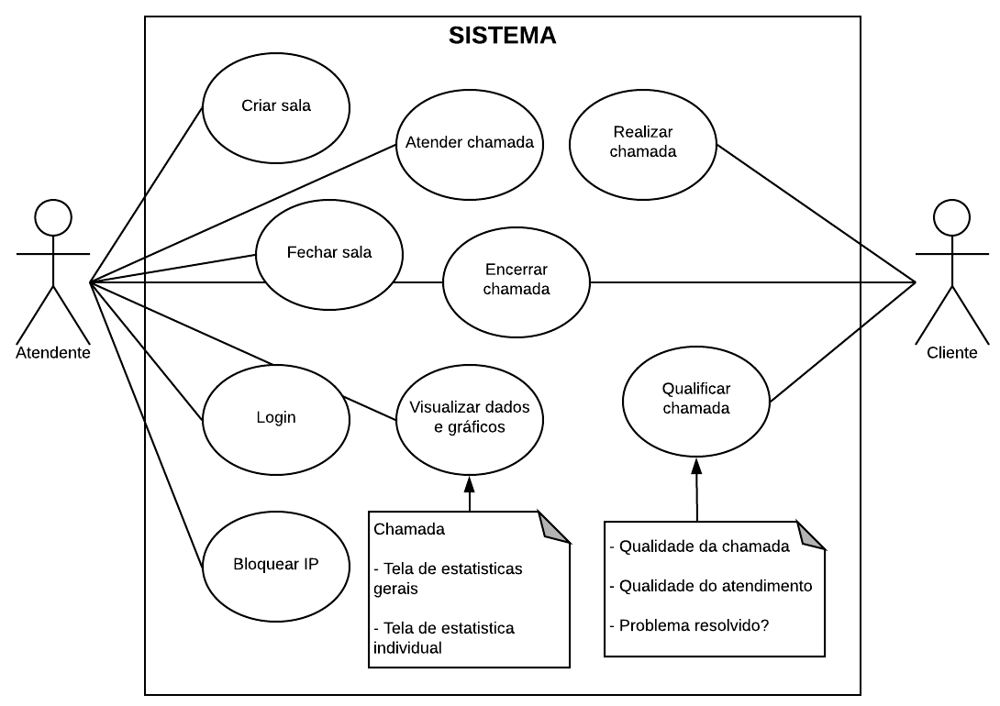

## Architecture

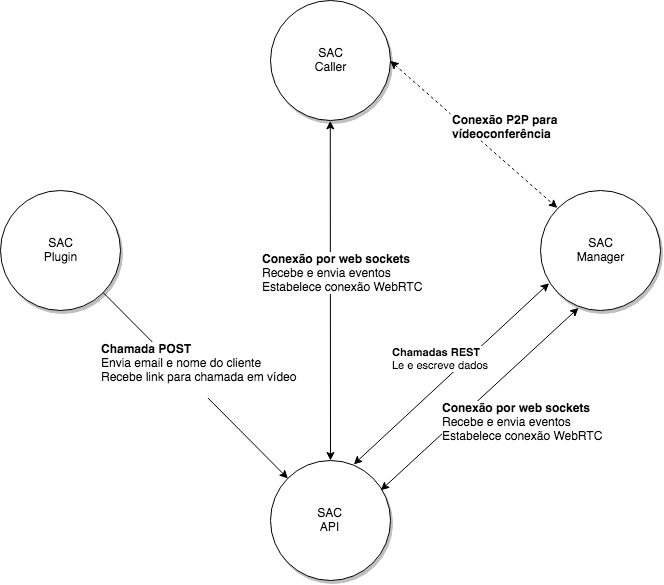

### [sac-caller](./sac-caller/)

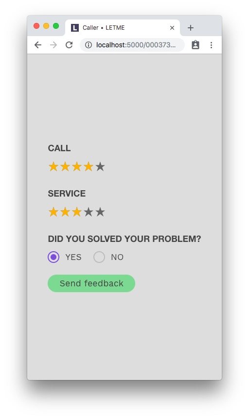
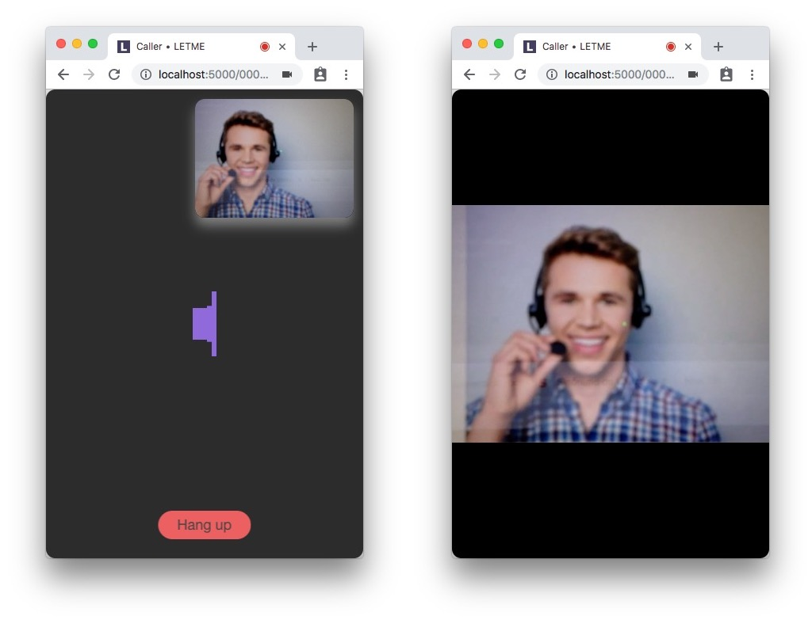

### [sac-manager](./sac-manager/)

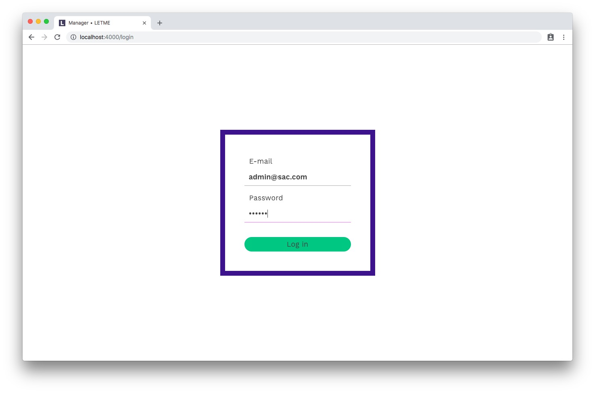
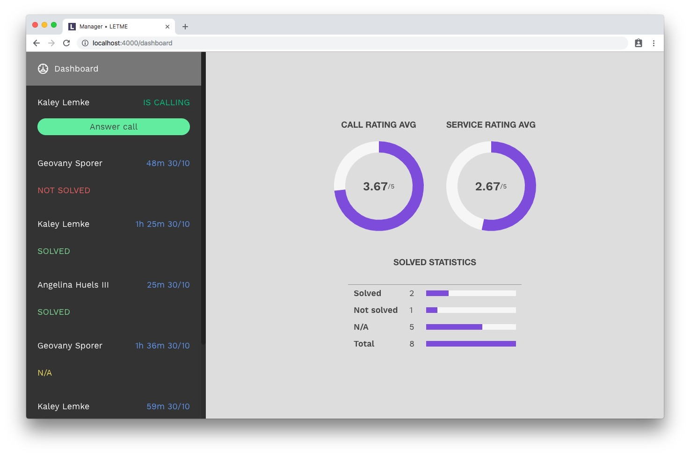
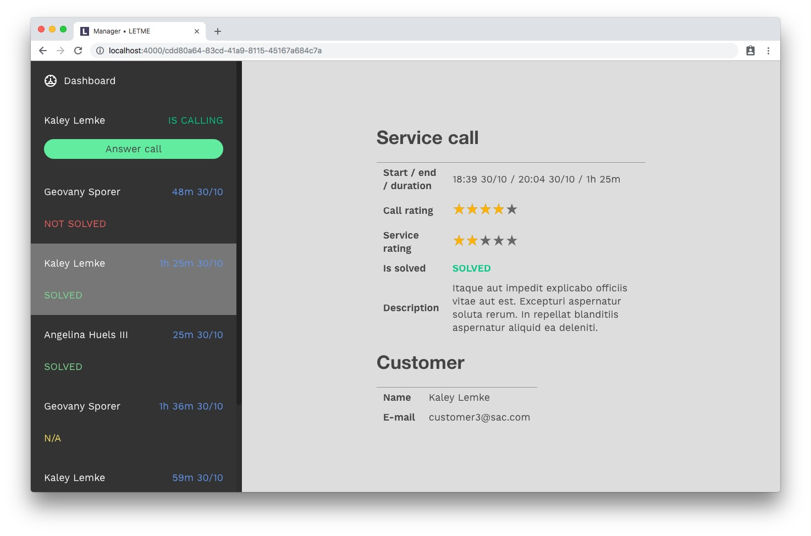
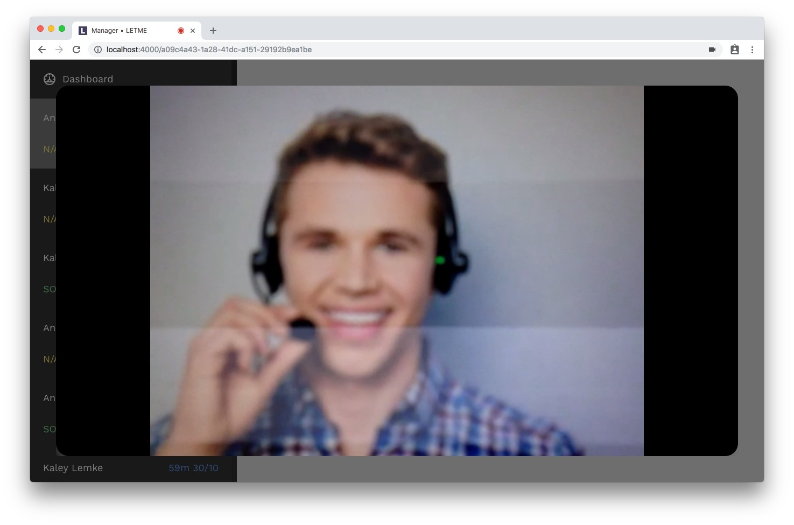
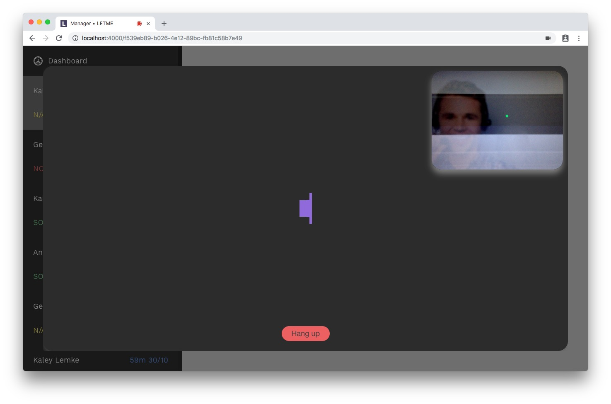

### [sac-api](./sac-api/)

## Prototypes

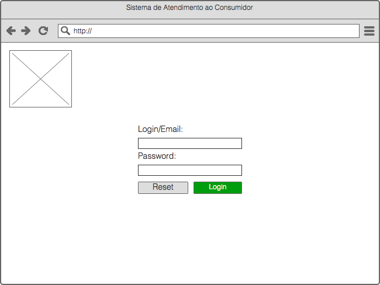
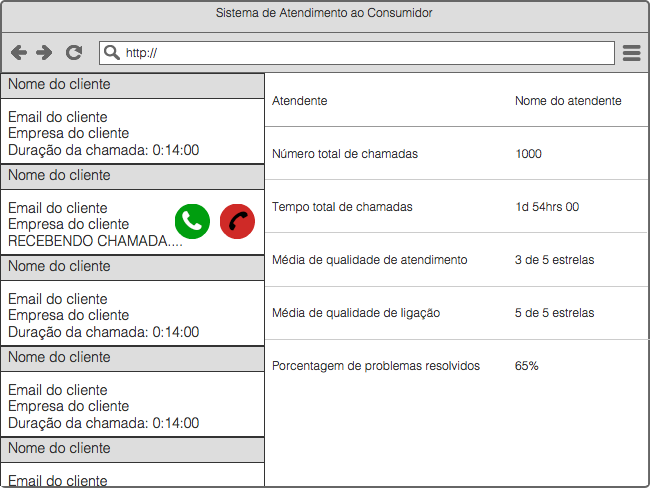
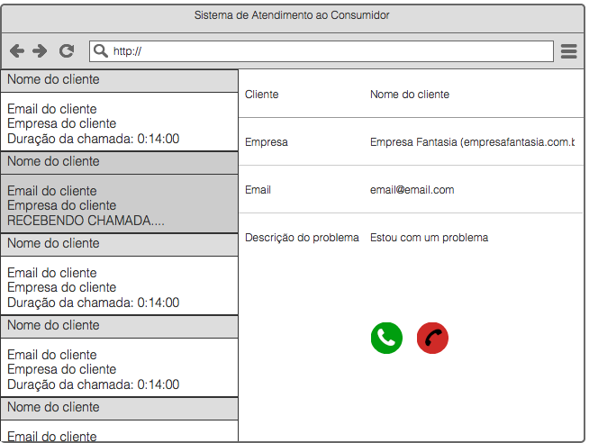
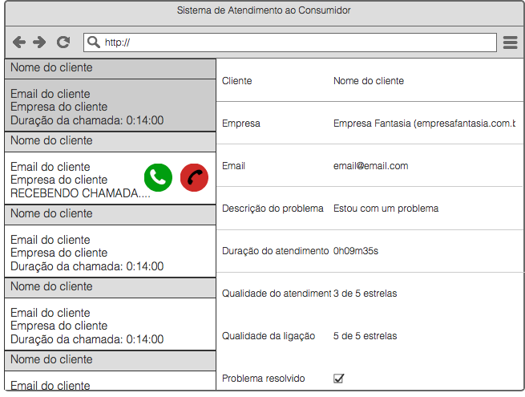
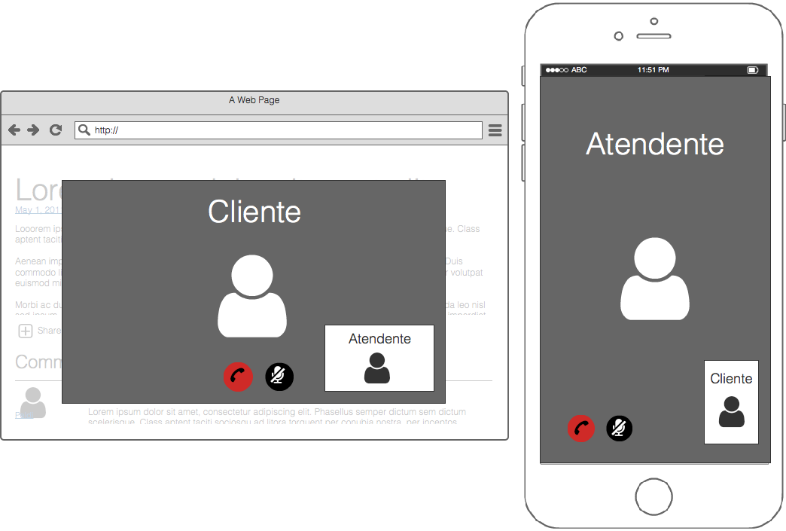
